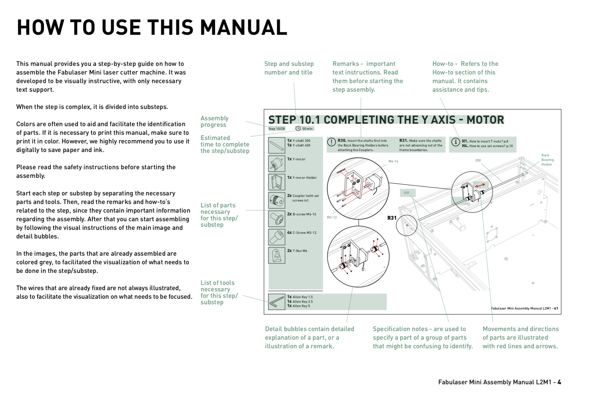

<h1 style=align="center">Fabulaser Mini</h1>

<i>An open source laser cutter within your reach.</i>

Introduction 
---
Fabulaser Mini is a compact, yet  powerful, open source laser cutter. Developed to fit in Fab Labs and classrooms, it aims to lower the boundaries of accessing laser cutting technology, representing an ideal compromise between performance and cost. 

Versions
--
Fabulaser Mini V2

A tool to make, a tool to learn.
--
In comparison to commercial laser cutters, Fabulaser Mini adds on top of the laser cutting functionalities a valuable learning experience. Ideally built together with students during a workshop, Fabulaser Mini will give to the user not only the possibility to laser cut, but also to learn how the machine is made, how it works. And other than learning about electronics, mechanics and lasers, the final user will also have a deep knowledge of the machine, so to be able to efficiently execute maintenance, apply improvements and even design his own machine later on!

The Assembly Manual
--

Fabulaser Mini comes with state  of art building instruction manual, detailing any of the many building details. Divided in logical steps, the manual also instructs on general building practices, the laser calibration and how to connect all the electronics of the machine. Teachers and lectures can also use the manual to divide workshop participants into building groups.

The Kit
--

Fabulaser Mini kit, is the one-stop solution for everything you need to fully use the laser cutting capabilities of Fabulaser Mini. Providing all the required parts and special tools to build the laser cutter, Fabulaser Mini kit also provides all the additional accessory to start laser cutting out of the box. As well all the required adapter and connection are provided, so that the user only have to concentrate on assembly, without losing time in searching and buying additional parts.

Included in the Fabulaser Kit:

- Fabulaser Mini machine parts
- air assist compressor
- exhaust radial fan
- indoor air filter
- water chiller
- all the required connections/adapters

More info on Fabulaser Mini are available at: [http://fabulaser.net/](http://fabulaser.net/)

Fabulaser Mini specifications
--
- laser source: 40W CO2
- cutting area: 600x400mm
- resolution: 0.05mm 
- max. cutting thickness: 
  - 8mm acrylic
  - 6mm MDF
  - 8mm Plywood
- max speed: 400mm/s
- motion: linear rails
- housing: aluminum composite
- bed: aluminum lamella
- frame: aluminum profiles
- controller: 32bit LPC1768
- firmware: [grbl-LPC](https://github.com/cprezzi/grbl-LPC)
- machine dimensions: 870x810x380mm

Files
--
- **[Assembly manual](manual)**
- **[BOM](Fabulaser_V2.1_BOM.pdf)**
- **[Firmware](firmware)**
- **[CAD](cad)**
- **[Converter PCB](converterPCB)**
- **[Settings](settings)**
- **[User manual](Fabulaser_User_manual_L2M1.pdf)**

Authors
--

The Fabulaser Mini Assembly Manual authors are: 
- **Marc Kohlen, marckohlen@3dinx.com**
- **Liane Sayuri Honda, licasayurih@gmail.com** 

Fabulaser Mini has been designed, developed and manufactured by: 

- **Daniele Ingrassia, daniele@inmachines.net**
- **[InMachines Ingrassia GmbH](https://www.inmachines.net/)** 

License
--

The Fabulaser Mini hardware design, CAD and PCB files, BOM, settings and relative files are are released under the following open source license:

- CERN Open Hardware Licence Version 2 Weakly Reciprocal - **[CERN-OHL-W](LICENSE_CERN_OHL_W_V2.txt)**

The Fabulaser assembly manual, pictures and presentation text of this repository are released under the following license:

- Creative-Commons-Attribution-ShareAlike 4.0 International - **[CC BY-SA 4.0](LICENSE_CC_BY_SA_4.0.txt)**

Fabulaser Mini uses grbl-LPC [https://github.com/cprezzi/grbl-LPC](https://github.com/cprezzi/grbl-LPC), released under the [GPLv3 license](https://www.gnu.org/licenses/gpl-3.0.en.html).
